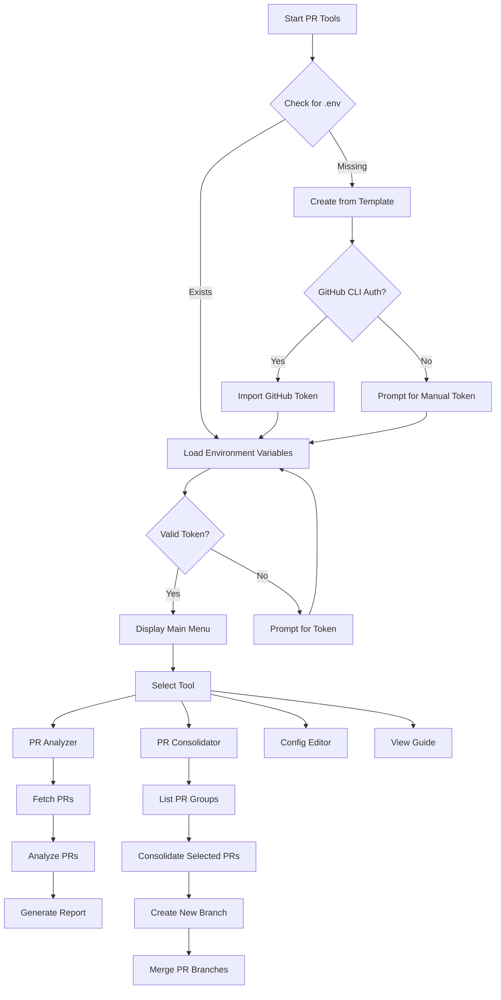
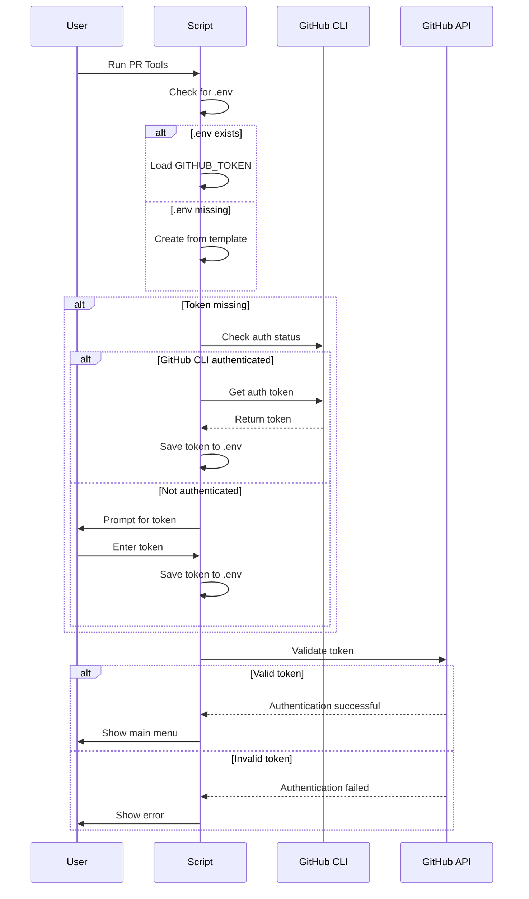
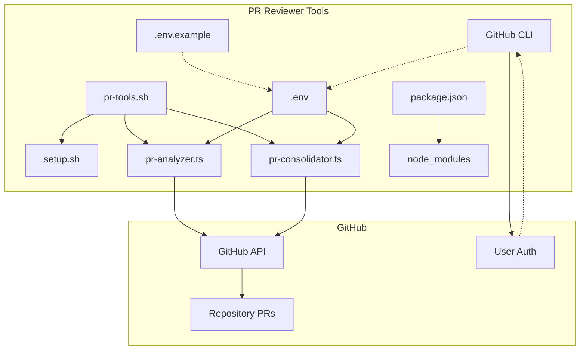
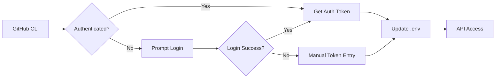
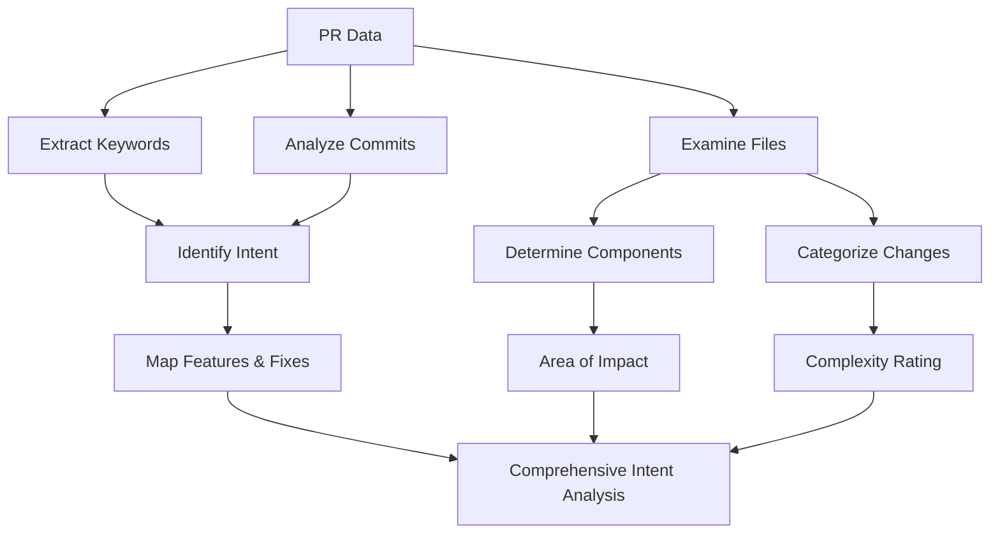
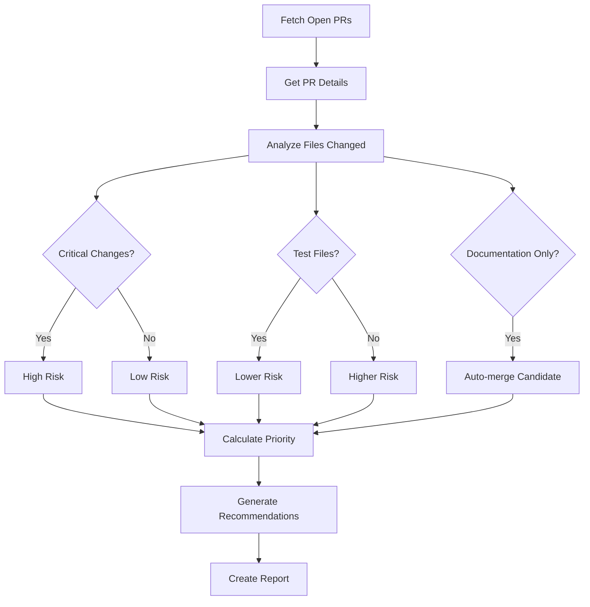
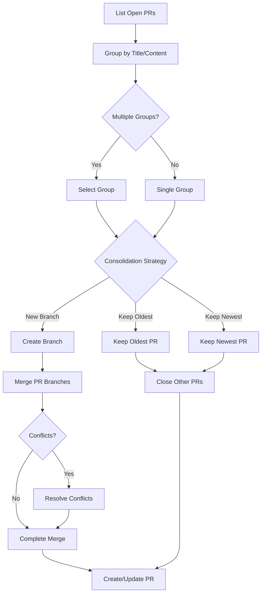
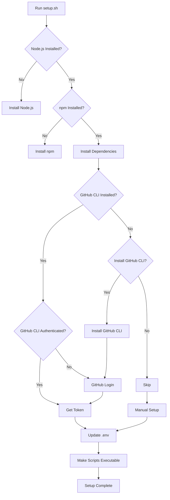

# PR Reviewer Tools v2.0

## Overview

The PR Reviewer Tools are a set of utilities designed to help manage and analyze pull requests in the AIrie-teachings-dev repository. These tools provide automated analysis, recommendation, and consolidation capabilities for PRs.

## Application Flow



## Authentication Process



## System Architecture



## Key Components

### 1. PR Analyzer (`pr-analyzer.ts`)

The PR Analyzer evaluates open pull requests and provides:
- Risk assessment for each PR
- Impact analysis on critical code areas
- Review recommendations
- Priority scores
- Merge impact evaluation
- Change intent analysis

### 2. PR Consolidator (`pr-consolidator.ts`)

The PR Consolidator helps combine related PRs:
- Identifies PRs with similar titles or changes
- Provides options for consolidation approaches
- Creates new branches with combined changes
- Handles merge conflicts
- Preserves author attribution

### 3. Interactive Shell Script (`pr-tools.sh`)

The shell script provides a user-friendly interface:
- Environment setup and validation
- Token management
- Tool selection
- Configuration editing
- Dependency installation

## GitHub Authentication Flow

The tools support two authentication methods:

### 1. GitHub CLI Integration (Recommended)



When you run the tools:
1. The script checks if GitHub CLI is installed and authenticated
2. If authenticated, it retrieves your token automatically
3. The token is saved to the .env file
4. All API calls use this token

### 2. Manual Token Setup

If GitHub CLI isn't available:
1. Create a personal access token at https://github.com/settings/tokens
2. Grant 'repo' scope permissions
3. Add the token to your .env file
4. The tools will validate and use this token

## Configuration Options

Your .env file controls the tool behavior:

```
# GitHub Token (required for API access)
GITHUB_TOKEN=your_github_token_here

# GitHub Organization and Repository
GITHUB_ORG=THE-AI-REAL-ESTATE-INVESTOR
GITHUB_REPO=AIrie-teachings-dev

# Critical Directories (comma-separated)
CRITICAL_DIRECTORIES=app/lib/services,app/components/auth,app/api,middleware

# Directories that require tests (comma-separated)
TEST_REQUIRED_DIRS=services,utils,api

# Auto-merge patterns (comma-separated)
AUTOMERGE_PATTERNS=docs/,README.md,*.md
```

## Change Intent Analysis

The PR Analyzer now includes a powerful Change Intent Analysis feature that examines PRs to understand what they're trying to accomplish:



The Change Intent Analysis provides:

1. **PR Intent Detection**: Automatically identifies if a PR is a bug fix, new feature, refactoring, etc.
2. **Change Type Classification**: Categorizes changes as New Features, Enhancements, Bug Fixes, or Removals
3. **Component Impact Mapping**: Shows which components/directories are affected by the changes
4. **Feature & Fix Extraction**: Identifies specific features being added or bugs being fixed
5. **Complexity Assessment**: Rates PR complexity as Low, Medium, or High based on scope of changes
6. **Implementation Details**: Provides insights into the technical implementation approach

This analysis helps reviewers understand:
- What the PR is trying to accomplish
- Which areas of the codebase are affected
- The risk level associated with the changes
- The amount of effort required to review the PR

The analysis appears in the PR report like this:

```markdown
#### Change Intent Analysis

**Intent:** Bug fix
**Change Types:** Bug Fix, Enhancement
**Components Affected:** app/components, app/lib/services
**Area of Impact:** app/components, app/lib/services
**Complexity:** Medium

**Suggested Fixes:** 
- fix authentication issue
- fix redirect after login

**Implementation Details:** Changes involve ts, tsx files with 156 additions and 42 deletions
```

## PR Analysis Process



## PR Consolidation Process



## Installation and Setup

The setup process ensures all dependencies are properly installed:



## Troubleshooting

Common issues and solutions:

1. **Bad credentials error**
   - Token may be expired or invalid
   - Use GitHub CLI integration to refresh
   - Generate a new token if needed

2. **Type errors in TypeScript**
   - Run `npm install` to ensure all dependencies are installed
   - Check TypeScript version compatibility

3. **Permission denied for scripts**
   - Run `chmod +x pr-tools.sh` and `chmod +x setup.sh`

4. **GitHub API rate limiting**
   - Use authenticated requests (token required)
   - Implement request throttling for large repos

## Security Considerations

The PR tools handle sensitive GitHub tokens:

- Tokens are stored locally in the .env file (not in git)
- The .gitignore prevents accidental token commits
- Tokens should have minimal required permissions
- Token validation occurs before API access
- GitHub CLI integration uses your existing authentication

## Conclusion

The PR Reviewer Tools provide a comprehensive solution for managing pull requests in the AIrie-teachings-dev repository. By streamlining the review process and providing automated analysis, these tools help maintain code quality and development velocity. 